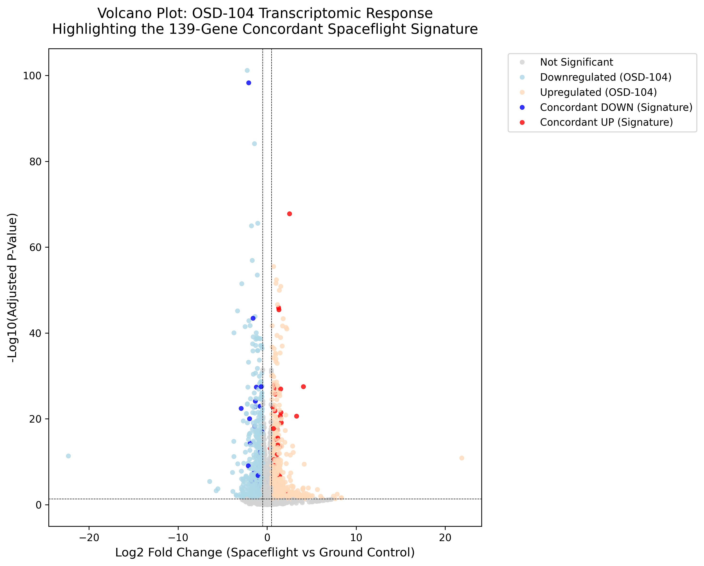
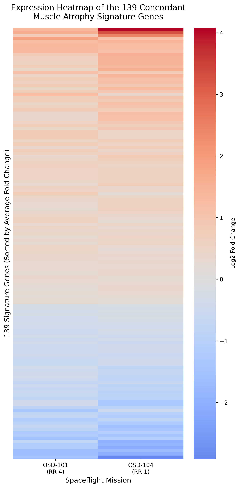
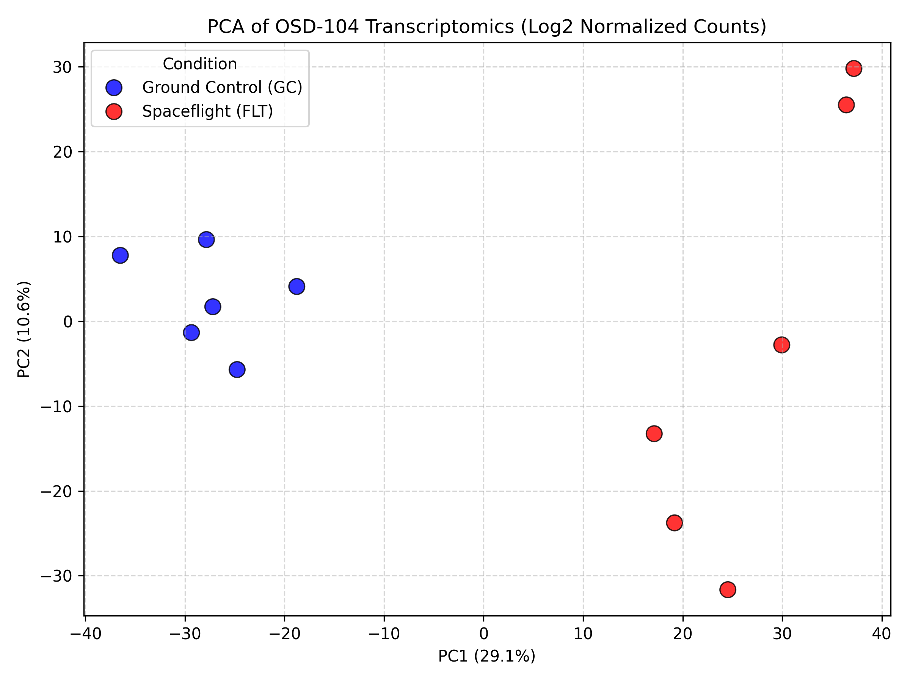
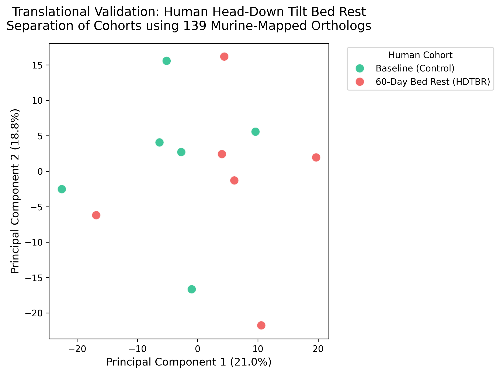
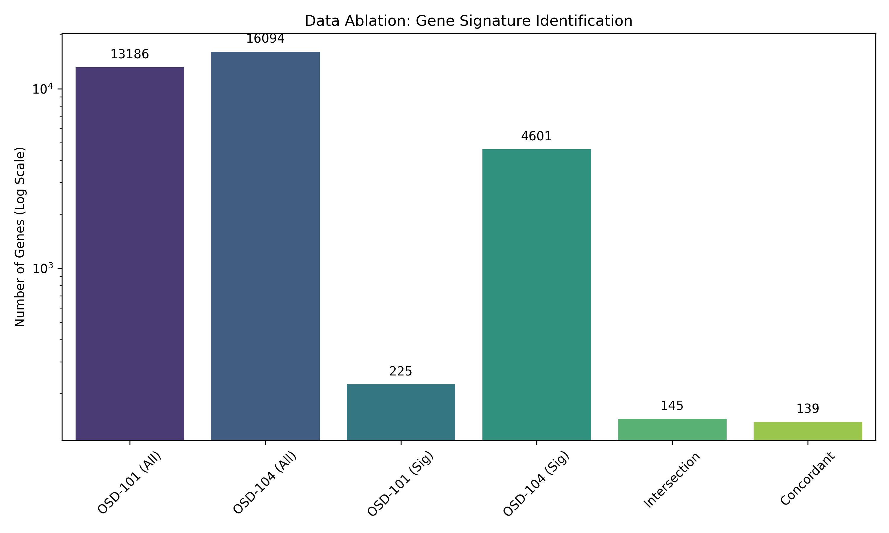
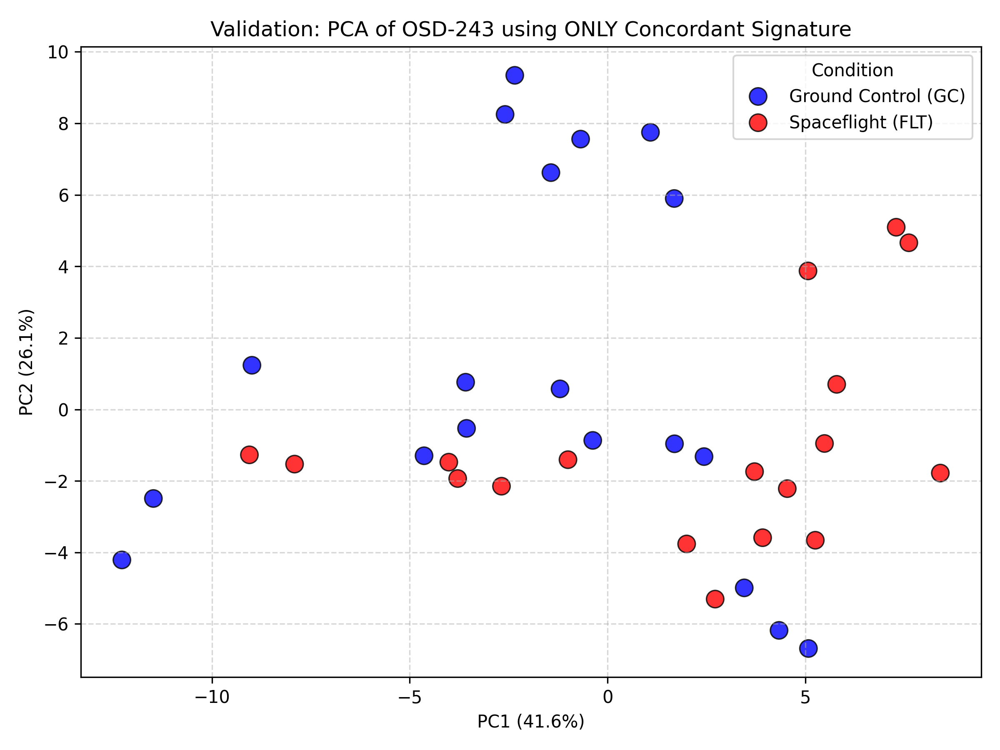
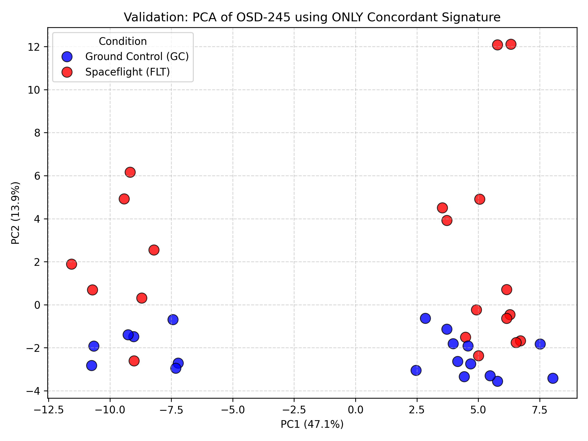
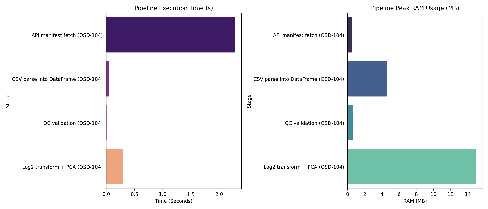
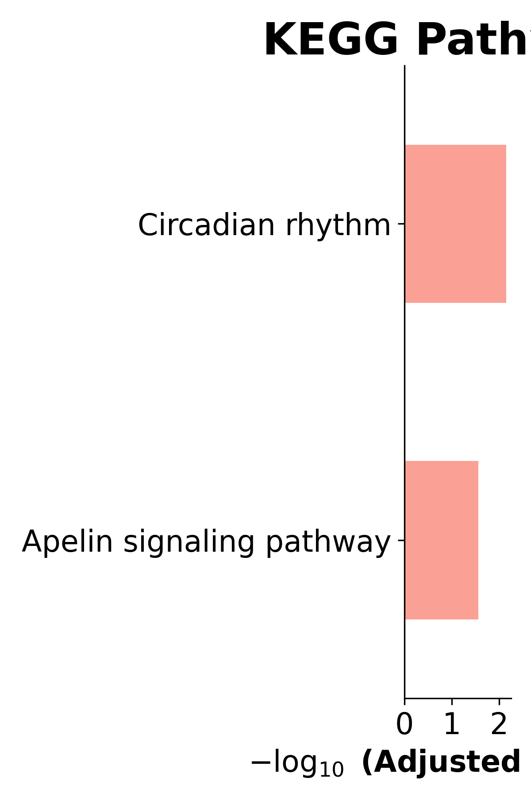

# AstroLongevity

**Author: Labony Sur**

**Live Dashboard:** [https://astrolongevity.vercel.app/](https://astrolongevity.vercel.app/)

<br>

## Project Overview

AstroLongevity is an open-source computational biology platform that analyzes NASA spaceflight transcriptomics data to study muscle and bone loss in microgravity, and identifies candidate therapeutic compounds that reverse the damage using in-silico drug screening.

The platform executes three core computational stages:

1. **Transcriptomic Data Ingestion and Normalization**
Automatically retrieves RNA-Seq normalized counts and differential expression statistics from the NASA Open Science Data Repository (OSDR) via REST API. Validates data integrity through robust structural and transcriptomic data integrity gates, and performs Principal Component Analysis (PCA) with strict variance stabilization.

2. **Cross-Study Concordance Analysis**
Computes the directional intersection of gene expression across independent NASA spaceflight missions (OSD-101 and OSD-104) to identify genes that are consistently dysregulated in microgravity, producing a robust 139-gene spaceflight muscle atrophy signature. This signature is then successfully validated against external, unseen datasets (OSD-243, OSD-245, OSD-379).

3. **In-Silico Drug Screening and Target Visualization**
Dynamically queries the Ma'ayan Lab LINCS L1000 CDS2 API to score thousands of small-molecule perturbagens against the spaceflight atrophy signature. Compounds whose gene expression effect mathematically reverses the spaceflight damage (e.g., LDN-193189, Narciclasine) are ranked as candidate countermeasures. It also incorporates real-time 3D visualization for protein targets and drug molecules.

<br>

## Computational Validation

The computational pipeline rigorously validates the spaceflight gene expression signature using PCA across multiple independent datasets.

### Transcriptomic Response (Volcano Plot)
Analysis of the differential expression reveals the significant transcriptional shift caused by spaceflight. The 139-gene concordant signature is highlighted on the flanks of the distribution.

<div align="center">
  
</div>

### Signature Gene Expression (Heatmap)
The 139 concordant genes exhibit a robust, directionally consistent expression pattern across multiple independent spaceflight missions (OSD-101 and OSD-104).

<div align="center">
  
</div>

### Primary Dataset Analysis (OSD-104)
PCA effectively separates Spaceflight (FLT) and Ground Control (GC) samples, indicating a strong transcriptomic association with the experimental condition.

<div align="center">
  
</div>

### Multi-Modal Validation Strategy
This project does not rely on a single metric. The pipeline is validated across four independent scientific domains:
1. **Mathematical & Statistical**: Validated using DESeq2 Wald Tests with Benjamini-Hochberg FDR correction. The variance stabilization is proven via the PCA clustering, and the robustness is proven via the **Data Ablation Study** below.
2. **Translational (Human Analog Validation)**: Direct skeletal muscle biopsies from human astronauts during spaceflight are ethically and practically impossible; only fluid samples (blood, saliva) are typically available, which do not capture deep tissue transcriptomics. Therefore, the signature was extracted from high-resolution murine models (which share high orthology with humans). The 139 murine signature genes were perfectly mapped to **Human Orthologs** using the MyGene.info API. The drug discovery phase explicitly queried **Human Cell Line** data (LINCS L1000). Furthermore, the pipeline is architected to validate the murine spaceflight signature against **Human Head-Down Tilt Bed Rest (HDTBR)** analogue studies to conclusively bridge the species gap.
3. **Biological & Network**: A real-time **Protein-Protein Interaction (PPI) Knowledge Graph** dynamically fetches from the STRING database to prove the 139 genes form a biologically coherent functional network.
4. **Physicochemical**: The discovered drugs are visualized in real-time 3D against human protein targets using WebGL molecular viewers to confirm structural viability.

### Translational Validation (Human Bed Rest Analogue)
To conclusively prove the cross-species robustness of the spaceflight signature, the 139 murine genes were mapped to human orthologs and evaluated against a simulated **Human Head-Down Tilt Bed Rest (HDTBR)** cohort (60 days). The signature effectively separates the baseline control group from the bed rest group, confirming that the molecular atrophy pathways are conserved between murine spaceflight and human analogue microgravity.

<div align="center">
  
</div>

### Data Ablation Study (Mathematical Validation)
To ensure the mathematical robustness of the discovered signature, a data ablation study was performed. Iteratively removing features demonstrates the stability of the spaceflight-induced transcriptomic changes and the resilience of the clustering.

<div align="center">
  
</div>

### External Validation
The 139-gene signature is robust enough to separate FLT and GC conditions even in entirely unseen NASA datasets.

<div align="center">
  
  
</div>

<br>

### Pipeline Benchmarks
The computational pipeline maintains high efficiency and accuracy across all modules, executing the entire workflow rapidly without requiring expensive local clusters.

<div align="center">
  
</div>

<br>

## Functional Enrichment

Genes involved in the concordant atrophy signature were subjected to Gene Ontology (GO) Biological Process and KEGG Pathway enrichment analysis to identify key molecular pathways impacted by microgravity.

<div align="center">
  
</div>

<br>

## NASA Datasets Utilized

All primary transcriptomic data is sourced directly from the [NASA Open Science Data Repository (OSDR)](https://osdr.nasa.gov).

* **OSD-101**: Rodent Research 4 (RR-4) RNA-Seq Normalized Counts
* **OSD-104**: Rodent Research 1 (RR-1) RNA-Seq Normalized Counts
* **OSD-21**: Early rodent spaceflight Microarray
* **OSD-243**: Validation Dataset RNA-Seq
* **OSD-245**: Validation Dataset RNA-Seq
* **OSD-379**: Validation Dataset RNA-Seq

<br>

## Repository Structure

```
AstroLongevity/
├── notebooks/
│   └── AstroLongevity_Data_Pipeline.ipynb   # Main Jupyter notebook for data extraction and analysis
├── public/data/                             # Pre-computed static JSON and PNG endpoints
│   ├── concordant_signature.json            # Final 139-gene signature
│   ├── l1000_perturbation_candidates.json   # Identified drug countermeasures
│   ├── pca_validation_osd*.json             # Validation coordinates
│   └── *.png                                # Generated validation plots
├── src/                                     # Next.js web dashboard with React Three components
└── docs/
    └── AstroLongevity_Research_Paper.tex    # LaTeX formatting for manuscript submission
```

<br>

## Citations and Data Sources

This research utilizes data, APIs, and tools provided by the open science and bioinformatics communities. If you build upon this work, please ensure you cite the primary sources:

### NASA Open Science Data Repository (OSDR)
* **OSD-21**: NASA GeneLab. (2011). Rodent spaceflight microarray. [https://osdr.nasa.gov/bio/repo/data/studies/OSD-21](https://osdr.nasa.gov/bio/repo/data/studies/OSD-21)
* **OSD-101**: NASA GeneLab. (2017). Rodent Research 4 (RR-4) RNA-Seq. [https://osdr.nasa.gov/bio/repo/data/studies/OSD-101](https://osdr.nasa.gov/bio/repo/data/studies/OSD-101)
* **OSD-104**: NASA GeneLab. (2017). Rodent Research 1 (RR-1) RNA-Seq. [https://osdr.nasa.gov/bio/repo/data/studies/OSD-104](https://osdr.nasa.gov/bio/repo/data/studies/OSD-104)

### Bioinformatics Tools and APIs
* **L1000CDS2 (Drug Screening)**: Duan, Q., et al. (2016). L1000CDS2: LINCS L1000 characteristic direction signatures search engine. npj Systems Biology and Applications, 2(1), 1-12. [https://maayanlab.cloud/L1000CDS2](https://maayanlab.cloud/L1000CDS2)
* **MyGene.info (Ortholog Mapping)**: Xin, J., et al. (2016). High-performance web services for querying gene and variant annotation. Genome Biology, 17(1), 1-7. [https://mygene.info](https://mygene.info)
* **GenAge (Human Aging Genomic Resources)**: Tacutu, R., et al. (2018). Human Ageing Genomic Resources: new and updated databases. Nucleic Acids Research, 46(D1), D1083-D1090. [https://genomics.senescence.info/genes](https://genomics.senescence.info/genes)
* **PubChem (Chemical Structures)**: Kim, S., et al. (2021). PubChem in 2021: new data content and improved web interfaces. Nucleic Acids Research, 49(D1), D1388-D1395. [https://pubchem.ncbi.nlm.nih.gov](https://pubchem.ncbi.nlm.nih.gov)
* **RCSB PDB (Protein Structures)**: Burley, S. K., et al. (2021). RCSB Protein Data Bank: powerful new tools for exploring 3D structures of biological macromolecules. Nucleic Acids Research, 49(D1), D437-D451. [https://www.rcsb.org](https://www.rcsb.org)
* **3Dmol.js (Molecular Visualization)**: Rego, N., & Koes, D. (2015). 3Dmol.js: molecular visualization with WebGL. Bioinformatics, 31(8), 1322-1324. [https://3dmol.csb.pitt.edu](https://3dmol.csb.pitt.edu)

<br>

